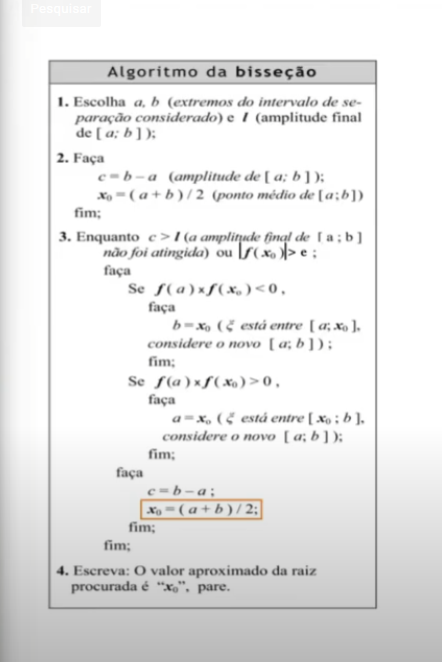

# Cálculo Numérico

Essa CCR envolve operações de adição, subtração, multiplicação, divisão, potenciação e radiciação, envolvendo os números reais. Entretanto o calculo numerico está diretamente ligado às expressões algébricas, envolvendo equações, inequações e sistemas de equações. Com esses fundamentos e instrumentos da matemática aplicada e computacional,  temos a finalidade de permitir a resolução de problemas da pesquisa científica e tecnológica, que podem ser representados e resolvidos numericamente, envolvendo modelagem e simulação, exemplificando e resolvendo problemas numéricos .

## Zero de Funções / Método da Bissecção

O Método da Bissecção converge sempre que a função f(x) for contínua no intervalo [a,b] e f(a)f(b) < 0. Entretanto, a convergência do Método da Bissecção é muito lenta, pois se o intervalo inicial é tal que (b0 – a0) >> ε e se ε for muito pequeno, o número de iterações tende a ser muito grande. Com isso temos o apoio da teoria da existencia da raíz no intervalo que nos ajuda no cálculo. 

Abaixo temos o fluxo de como funciona o codigo em python, com sequencia de passos e comentarios.

## Método das Cordas ou secante

## Método Interpolação Lagrange

## Método Interpolação Newton

## Como Contribuir

Para contribuir e deixar a comunidade open source um lugar incrivel para aprender, projetar, criar e inspirar outras pessoas. Basta seguir as instruções logo abaixo:

1. Realize um Fork do projeto
2. Crie um branch com a nova feature (`git checkout -b feature/featureCNumerico`)
3. Realize o Commit (`git commit -m 'Add some featureCNumerico'`)
4. Realize o Push no Branch (`git push origin feature/featureCNumerico`)
5. Abra um Pull Request

 

## Autores

- **Isabela** - _Acadêmica do Curso de Engenharia Ambiental -UFFS_. 
- **Simone** - _Acadêmica do Curso de Engenharia Ambiental -UFFS_. 
- **[Rafinha](https://github.com/rafalup)** - _Acadêmica do Curso de Ciência da Computação -UFFS_. 
